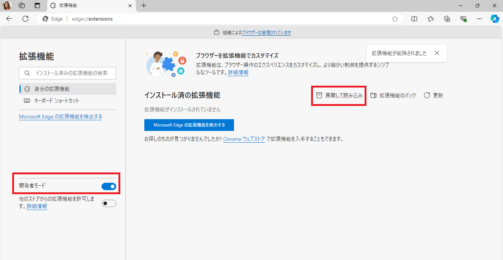

# mldi-extension
The Chrome/Edge extension for the MLDI project.

## Installation
To install the extension, please folow the steps below:

1. download the extension files as a zip file
2. extract the zip file
3. open the browser and go to the extensions page (chrome://extensions/ or edge://extensions/)
4. enable the developer mode
5. click on the "Load unpacked" button, and select the extracted folder

<!-- use img tag to resize -->

6. the extension should now be installed!✨

## Notes
Currently, this extension is under development, and only summary features are available.
Please look forward to the future updates!
